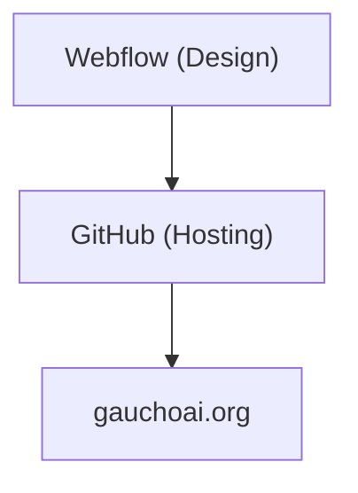
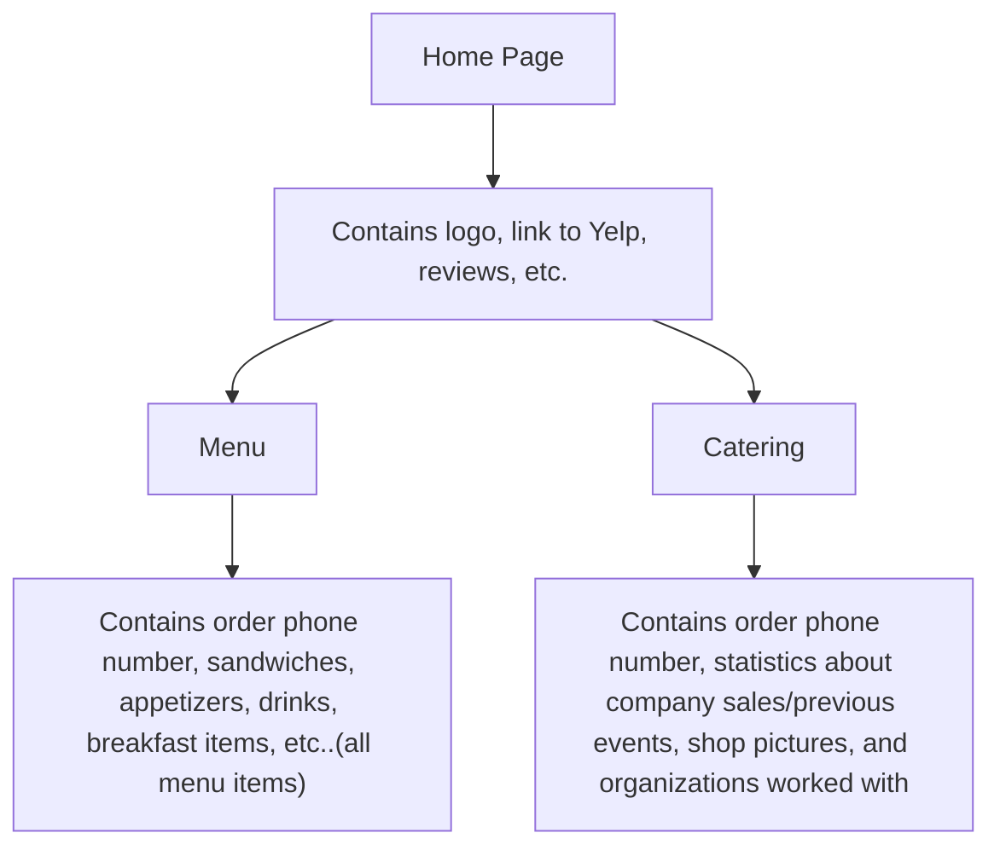

# Sam's To Go IV

### [Figma Project](https://www.figma.com/design/yGWfScSw4mYY1mNQQKu9bB/Sam's-To-Go?node-id=0-1&p=f&t=l17wjuxCWkOub9P3-0)

### [Canva Project](https://www.canva.com/design/DAGdamA0BBs/GMz_1n7ApRGurP0XghzSeQ/edit?utm_content=DAGdamA0BBs&utm_campaign=designshare&utm_medium=link2&utm_source=sharebutton)

### [Google Sheet - Menu](https://docs.google.com/spreadsheets/d/1TAzWH3AjvOQFheClv_jF5n9che642F3QdltCs7PwcF8/edit?usp=sharing)

## Domain

[samstogoislavista.com](https://www.samstogoislavista.com)

## Description
This is the official GitHub repo for Sam's To Go's project. The owner wants a website which is clean and simple to replace the older, inactive, non-editable sites that they currently have. He wants some basic stuff like places for pictures and a menu (one that he can go in and change whenever he wants).

## Repo Organization

## Website Flow

