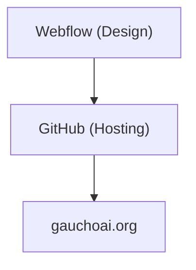
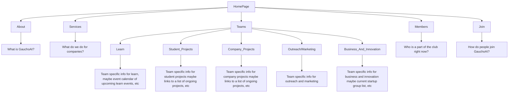

# Sam's To Go IV

### Figma Project[]
[Sam's To Go - Figma](https://www.figma.com/design/yGWfScSw4mYY1mNQQKu9bB/Sam's-To-Go?node-id=0-1&p=f&t=l17wjuxCWkOub9P3-0)

## Description
This is the official GitHub repo for Sam's To Go's project. The owner wants a website which is clean and simple to replace the older, inactive, non-editable sites that they currently have. He wants some basic stuff like places for pictures and a menu (one that he can go in and change whenever he wants).

## Repo Organization

## Website Flow

